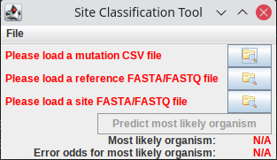
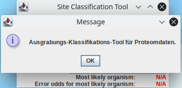
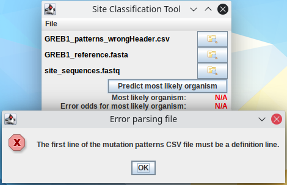
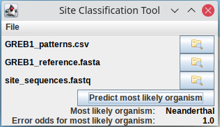
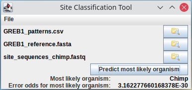

# Aufgabe zu Woche 7

In dieser Woche wird unser GUI interaktiv! Aber zunächst räumen wir ein wenig auf.

## Refaktorisierung der UI-Klassen

Nun, da unsere Interfaces etwas komplexer werden, wird es Zeit, den Code etwas schöner zu organisieren - es ist nicht sonderlich schön, das CLI mit einem Teil der Berechnungslogik in der Hauptklasse zu haben, während es noch eine separate Klasse für das GUI gibt.

### Herauslösen der Berechnungslogik

Zunächst lösen wir die Berechnungslogik aus der Hauptklasse heraus, damit GUI und CLI auf die gleiche Art die Analyse durchführen können: Erstellen Sie eine neue Klasse ```SequenceAnalysisManager``` in ```org.htw.prog2.aufgabe1.analysis``` mit der Methode ```public static SequenceAnalysis performAnalysis(String referenceFileName, String siteSequenceFileName, String mutationFileName) throws Exception```: Führt die Analyse durch (also das, was bisher nach dem Parsen der Kommandozeilenargumente in ```SiteClassification.main()``` passiert ist) und gibt die resultierende ```SequenceAnalysis``` zurück. Wirft eventuell dabei auftretende Exceptions (```throws NoValidReadersException, FileFormatException, IOException``` - nicht einfach nur ```throws Exception```, damit das aufrufende UI weiß, was alles behandelt werden muss) weiter. Gibt aber selber nichts auf der Kommandozeile aus! Das ist jetzt Aufgabe der aufrufenden UIs!

Um einen sauberen Zugriff auf die für die Analyse verwendeten Daten über das von ```SequenceAnalysisManager``` zurückgegebene ```SequenceAnalysis```-Objekt zu ermöglichen, implementieren Sie zusätzlich in ```SequenceAnalysis``` die folgenden drei getter:
    * ```public SequenceFile getSequences()```
    * ```public MutationFile getMutations()```
    * ```public String getReference()```
    * ```public double getBestErrorOdds()```: Gibt zu dem Organismennamen, der von ```getMostLikelyOrganism()``` zurückgegeben wird, die vorhergesagte Fehlerwahrscheinlichkeit zurück

### Dedizierte UI-Klassen für CLI und GUI

Erstellen Sie nun für das UI ein neues package ```org.htw.prog2.ui``` und refaktorisieren Sie wie folgt:

* Die Klasse ```SiteClassificationGUI``` kann dorthin verschoben werden.
* Erstellen Sie eine neue Klasse ```SiteClassificationCLI``` mit den folgenden Methoden: 
    * ```public static CommandLine parseOptions``` (die bisher in ```SiteClassification``` war)
    * Constructor, der die Kommandozeilen-Argumente (```String[] args```) nimmt, mittels ```SequenceAnalysisManager``` die Analyse durchführt und (wie zuvor in ```main```) die Ergebnisse auf der Kommandozeile ausgibt - nun aber unter Verwendung der getter aus ```SequenceAnalysis```. 
    
```SiteClassification``` ist danach sehr simpel aufgebaut und hat keine für CLI oder GUI spezifische Funktionalität mehr - dadurch ist es im Zweifelsfall trivial, weitere UIs (z.B. ein Webinterface oder einen REST-service, der über das Netzwerk als Dienst genutzt werden kann, zu integrieren):

```java
package org.htw.prog2.aufgabe1;
import org.htw.prog2.aufgabe1.ui.SiteClassificationCLI;
import org.htw.prog2.aufgabe1.ui.SiteClassificationGUI;

public class HIVDiagnostics {

    public static void main(String[] args) {
        if(args.length == 0) {
            SiteClassificationGUI gui = new SiteClassificationGUI();
        }
        else {
            SiteClassificationCLI cli = new SiteClassificationCLI(args);
        }
    }
}
```

Randnotiz: Dafür muss noch das ```gui.setVisible(true);``` aus ```main()``` in den Constructor von ```SiteClassificationGUI``` verschoben werden.

## Erweiterung des GUI

Nach erfolgter Refaktorisierung kann das GUI nun um Interaktionsmöglichkeiten erweitert werden.

### Menü

Dei beiden Menüeinträge brauchen ```ActionListener```:
* Für "About": ```JOptionPane``` mit kurzem Text anzeigen (siehe z. B. Beispiel-Screenshots am Ende)
* Für "Exit": Programm beenden

### Lade-Buttons

Die Interaktion mit den Lade-Buttons soll aus User-Sicht wie folgt aussehen:

* Die Labels mit den Dateinamen sind beim Programmstart rot
* Immer wenn ein Lade-Button gedrückt wird:
    * Es poppt ein `JFileChooser` mit Dateiendungsfilter (damit nur der richtige Dateityp geladen werden kann) auf
    * Falls eine Datei ausgewählt wird:
        * Der Name der Datei wird in dem Label angezeigt (intern wird für die spätere Auswertung auch der volle Dateipfad gespeichert)
        * Der Text des Labels wird schwarz
        * Falls alle Dateien geladen wurden, wird der Auswerte-Button aktiviert

Hier ist wieder einiges an gemeinsamer Funktionalität in allen nötigen ```ActionListener``` gemeinsam. Erstellen Sie entsprechend mehrere Klassen:
* Eine interne abstrakte Klasse ```LoadListener```, die ```ActionListener``` implementiert und:
    * Im Constructor ein String-Array mit zugelassenen Dateiendungen (z.B. "fasta", "fastq") sowie einen String mit der Beschreibung des Dateityps (z.B. "Sequenzdateien im FASTA- oder FASTQ-Format") für den JFileChooser übergeben bekommt
    * Eine abstrakte Methode ```setData(File loaded)``` besitzt (die in der konkreten Implementation den Text des korrekten Labels setzt und den Dateipfad in dem korrekten Attribut speichert)
    * Die Methode ```actionPerformed``` aus ```ActionListener``` überschreibt und die oben beschriebenen gemeinsamen Aktionen durchführt:
        * Einen entsprechenden ```JFileChooser``` anzeigen
        * Falls eine Datei ausgewählt wurde, ```setData(File loaded)``` aufrufen
        * Falls alle drei Dateien geladen wurden: Den Button "Predict best drug" aktiviert (über die Methode ```setActive(true)```).
* Für jeden Button: Einen anonymen ```LoadListener```, der in ```setData(File loaded)```:
    * Den vollen Pfad der Datei speichert
    * Das entsprechende Label auf den Dateinamen (```File.getName()```) setzt
    
### "Predict most likely organism"-Button

Implementieren Sie abschließend für den Button "Predict most likely organism" ebenfalls einen anonymen ```ActionListener```, der 
    * Mittels ```SequenceAnalysisManager.performAnalysis()``` die Berechnungen durchführt.
    * Falls eine Exception fliegt, ein ```JOptionPane``` mit ```e.getMessage()``` als Fehlertext und passendem Titel anzeigt:
        * ```IOException``` -> ```Error loading file```
        * ```NoValidReadersException``` -> ```Unsupported file format```
        * ```FileFormatException``` -> ```Error parsing file```
    * Die Ergebnisse (```SequenceAnalysis.getMostLikelyOrganism()```, ```SequenceAnalysis.getBestErrorOdds()```) in zwei neuen ```JLabel``` anzeigt (siehe Screenshots, neue Labels unter dem Berechnungs-Button).
    
#### Beispielbilder

##### Startbildschirm



##### About



##### Fehler



##### Berechnungsergebnis (keine Hinweise auf konkreten Organismus)



##### Berechnungsergebnis (Klarer Hinweis auf Chimpanse)



# Ergebnisscreenshots

Da wie beschrieben GUI-Tests in diesem Fall nicht möglich sind, erstellen Sie bitte wie bei der letzten Aufgabe einen Screenshot von Ihrem Programmfenster nach Durchführung der Berechnungen (also so wie der letzte Beispielscreenshot, unter "Berechnungsergebnis") und ersetzen Sie die Datei "Bilder/Aufgabe5_screenshot.png" durch Ihren Screenshot. Er müsste dann hier erscheinen:


